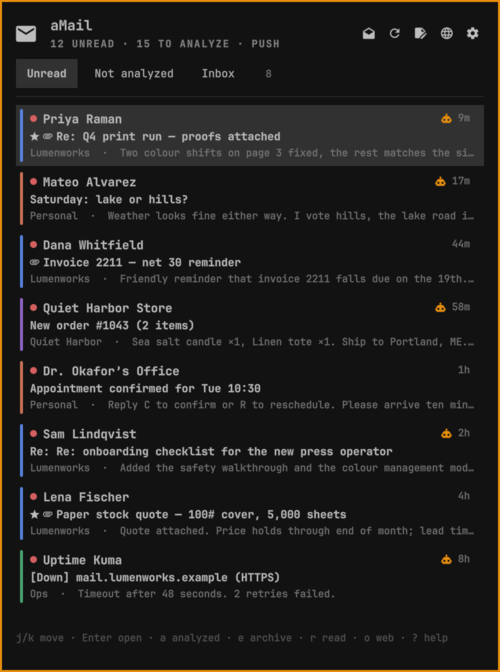
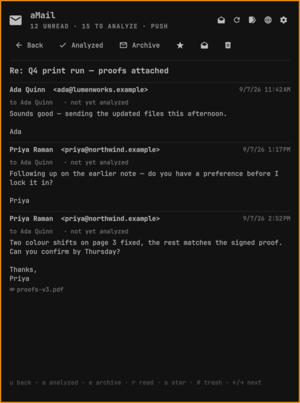
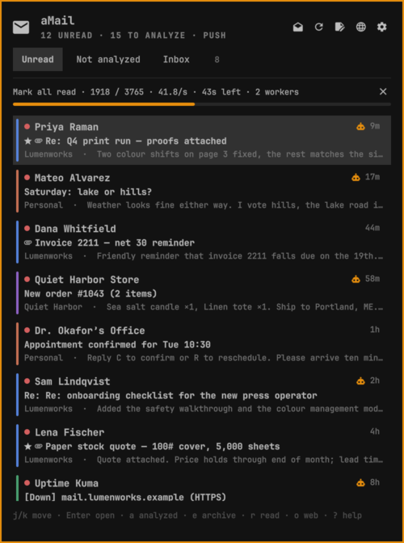
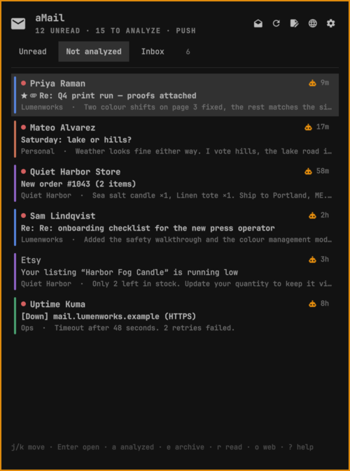
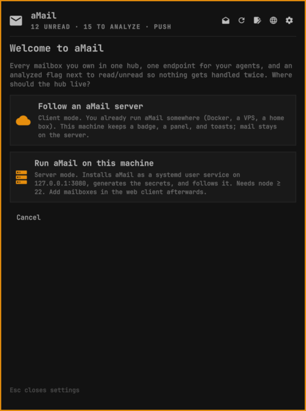
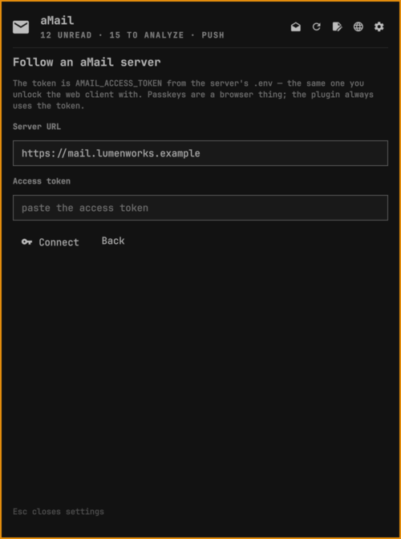
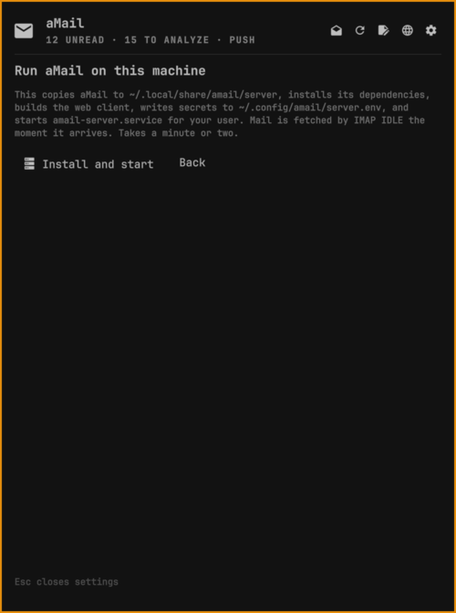
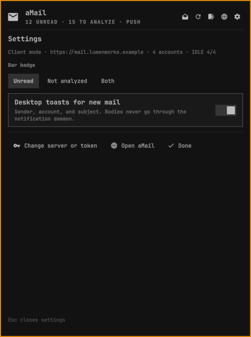

# aMail — Agentic Mail

aMail is a self-hosted mail client that holds all of your inboxes in one place and gives your agents a single, authenticated point of connection to every one of them.

It is **agentic first**: alongside the human read/unread state, every message carries an **analyzed / not yet analyzed** flag that agents set as they process mail. Ask for `is:unanalyzed`, do the work, mark it analyzed, and nothing gets handled twice — by an agent or by you.

aMail is the open-source continuation of GigaMail and upgrades existing GigaMail installations in place.

> aMail is an independent project. It is not affiliated with Google, Gmail, Apple, or Microsoft.

## What it does

- **Unified inbox** for any number of IMAP/SMTP accounts: Gmail, iCloud, Outlook, Mail-in-a-Box, or any custom server. Threading from `Message-ID`/`References` with a safe subject fallback.
- **One endpoint for agents.** A Streamable HTTP [MCP](https://modelcontextprotocol.io) server at `/mcp` plus a REST API at `/api`, both gated by the same access token. Cursor, Claude, or anything that speaks HTTP can list, search, read, reply, triage, and manage accounts.
- **Analyzed flags.** `analyzedAt`/`analyzedBy` per message, `unanalyzedCount` per conversation, `is:analyzed`/`is:unanalyzed` search operators, a "Not yet analyzed" queue in the sidebar, and `message_action: analyzed` for agents. Local-only; never written back to IMAP.
- **Explainable smart views.** Deterministic, on-device classification into Primary, GitHub CI, Logs, Status updates, and Ops errors, each with a human-readable reason. Routine infrastructure digests from sources you configure stay out of the default inbox unless they report a failure.
- **Flagged people.** Turn any set of addresses into a sidebar folder. Edit in Settings, or let an agent manage the list with `list_flags`/`set_flags`.
- **First-run wizard.** Connect inboxes, get agent config snippets, and learn the analyzed flow in four steps.
- **Private by default.** Remote content is blocked until you ask; when loaded, it is fetched server-side through an optional Tor/Privoxy relay, never by the browser. Known tracking pixels stay blocked. HTML is sanitized; SSRF targets are rejected.
- **Secure by default.** Credentials encrypted at rest (AES-256-GCM), access-token gate, passkey (WebAuthn) unlock, read-only non-root container bound to loopback.
- **A real mail client.** Compose with a visual HTML editor, recipient chips, attachments, per-account signatures and identities, Gmail-style shortcuts, right-click context menus on conversations, messages, drafts, and accounts, FTS5 search with operators, snooze, star, archive.

## Omarchy plugin

<p align="center"></p>

Two counters live in the bar. **󰇮 unread** is the human queue. **󰚩 not analyzed** is the agent queue: messages no agent has processed yet. Both move within about a second of new mail arriving when the server runs this fork.

<table>
  <tr>
    <td></td>
    <td></td>
  </tr>
  <tr>
    <td align="center"><sub>Unread view. Account colour on the left, robot glyph on anything an agent has not analyzed yet.</sub></td>
    <td align="center"><sub>A thread, with analyzed / archive / star / read / trash one key away.</sub></td>
  </tr>
  <tr>
    <td></td>
    <td></td>
  </tr>
  <tr>
    <td align="center"><sub>Bulk work runs as a throttled background job: progress, rate, ETA, worker count, cancel.</sub></td>
    <td align="center"><sub>The agent queue. <code>a</code> marks a conversation analyzed by hand.</sub></td>
  </tr>
  <tr>
    <td></td>
    <td></td>
  </tr>
  <tr>
    <td align="center"><sub>First run: follow a server you already run, or run aMail here.</sub></td>
    <td align="center"><sub>Client mode verifies the token live before saving it (0600).</sub></td>
  </tr>
  <tr>
    <td></td>
    <td></td>
  </tr>
  <tr>
    <td align="center"><sub>Server mode: secrets, systemd user unit, IMAP IDLE, done.</sub></td>
    <td align="center"><sub>Settings: which counters the bar shows, desktop toasts.</sub></td>
  </tr>
</table>

<sub>Every name, address, and subject in these screenshots is fabricated (<code>node plugin/demo.mjs</code> renders the same demo inbox on any machine; <code>node plugin/demo.mjs off</code> returns to live mail).</sub>


This repository is also an [Omarchy](https://omarchy.org) shell plugin: an email harness that wrangles many accounts into one funnel for your agents, and a simple mail client for you. aMail in the bar, a triage panel, desktop toasts for new mail. It runs in two modes.

| Mode | What runs where | When to use it |
| --- | --- | --- |
| **Client** | The plugin follows an aMail server you already run (Docker, a VPS, a home box). Only a small daemon runs on the desktop. | You have one hub and several machines. |
| **Server** | The plugin installs aMail on this machine as a systemd user service and follows it on `127.0.0.1:3080`. | This is the hub. |

Both modes share one plugin, one badge, one panel, and one MCP endpoint for your agents.

```sh
omarchy plugin add https://github.com/nova-centauri/aMail-agentic-mail-omarchy.git --enable
PLUGIN=~/.config/omarchy/plugins/io.github.nova-centauri.amail

$PLUGIN/bin/amail-plugin connect https://mail.example.com    # client mode: prompts for AMAIL_ACCESS_TOKEN
$PLUGIN/bin/amail-plugin server install                     # server mode: node ≥ 22, generates secrets, starts the service
```

Put `$PLUGIN/bin` on your `PATH` (or symlink `amail-plugin` into `~/.local/bin`) and the rest is:

```sh
amail-plugin status        # what the daemon sees: transport, counts, accounts, last event
amail-plugin open          # the full aMail web client as an Omarchy web app
amail-plugin mcp-config    # the MCP snippet for Cursor / Claude / Codex
amail-plugin set badge unanalyzed   # bar badge: unread (default), unanalyzed, or both
amail-plugin set toasts false
amail-plugin server logs   # server mode only
```

**Bar widget.** `󰇮 12  󰚩 15` is unread and not-yet-analyzed; `amail-plugin set badge unread|unanalyzed|both` picks what shows. Dimmed means the server is unreachable. Left-click opens the panel, middle-click refreshes, right-click opens the web client.

**Bulk work stays light.** Mark all read (the envelope in the header, or `M`) runs as a background job in the CLI, not in the shell: it pages through the server's unread view, then works with at most two concurrent requests, a pacing gap between them, and an automatic drop to one worker when the server slows down. The panel shows progress, rate, ETA, and a cancel button, and keeps the job running while closed. Meanwhile the daemon coalesces the resulting flood of state events into at most one refresh every 1.5 s.

**Panel.** Three views: Unread, Not analyzed, Inbox. `j`/`k` move, `Enter` reads the thread, `a` marks analyzed, `e` archives, `r` toggles read, `M` marks everything read, `s` stars, `#` trashes, `o` opens the web client, `c` composes there, `1`/`2`/`3` switch views, `?` shows the keys. Every action is applied optimistically and confirmed by the next push from the server.

**New mail is pushed, not polled.** This fork adds two pieces to the server so a message reaches the bar about a second after the provider receives it:

- `server/services/idle.js` parks one IMAP connection per account in `IDLE` on INBOX and runs an inbox-only sync the instant the server reports new mail (`AMAIL_IMAP_IDLE=true`, the default; `AMAIL_IMAP_IDLE_MAX_MS` re-issues IDLE before servers time it out). The periodic poll (`SYNC_INTERVAL_MINUTES`) stays on as the safety net.
- `GET /api/events` is a Server-Sent Events stream of `message.new`, `message.state`, `message.sent`, `sync.*`, and `account.*` events, gated by the same token as everything else. The plugin daemon holds one such connection; agents can too. `Last-Event-ID` replays what a short disconnect missed.

`GET /api/health` advertises `"features": ["events", "idle"]` so the plugin picks push automatically. Against an older aMail server it falls back to what a focused browser tab does: list polling every `pollSeconds` and a `POST /api/sync` nudge every `syncSeconds`.

**Files.** `~/.config/amail/plugin.json` (mode, URL, settings), `~/.config/amail/token` (0600), `~/.local/state/amail/state.json` (what the bar renders: subjects, senders, counts, ids; never bodies), and in server mode `~/.config/amail/server.env` plus `~/.local/share/amail/` (database and a private copy of the server). Message bodies are fetched on demand when you open a thread and are not written to disk by the plugin.

**Dependencies.** Client mode needs a JavaScript runtime for the plugin daemon: `node` (≥ 22) or `bun`, found on the usual paths including mise shims. Server mode needs `node` ≥ 22 and `npm` (the aMail server is Node; `better-sqlite3` ships prebuilt binaries), `openssl` for secret generation, `systemd --user`, and `rsync` (optional, `cp` fallback). The CLI uses `jq`, `curl`, and `gum` (optional, for the token prompt); toasts use `notify-send`; the web client opens through `omarchy-launch-webapp`. Everything the plugin writes lives under `~/.config/amail`, `~/.local/state/amail`, and `~/.local/share/amail`; it never edits Hyprland or Omarchy configuration.

**Remove.**

```sh
omarchy plugin remove io.github.nova-centauri.amail   # the widget and daemon
amail-plugin server uninstall                          # server mode only: stops and removes the systemd unit
rm -rf ~/.config/amail ~/.local/state/amail ~/.local/share/amail   # optional: token, state, local mail database
```

**IPC.** `omarchy-shell io.github.nova-centauri.amail status|open|close|toggle|refresh|web|counts`, `goto <conversationId>` to open one conversation (what a toast's Open button does), `view unread|unanalyzed|all`, `setup`, `snapshot <file.png>` to render the open panel to a PNG, and `debug` for geometry and job state.

## Quick start (Docker)

```sh
git clone https://github.com/<you>/amail.git && cd amail
cp .env.example .env
openssl rand -hex 32   # paste as AMAIL_ENCRYPTION_KEY
openssl rand -hex 32   # paste as AMAIL_ACCESS_TOKEN
sh deploy/launch.sh    # builds and starts aMail + the Tor relay, loopback-only
```

Open `http://127.0.0.1:3080` (through an SSH tunnel if the server is remote), unlock with the access token, and the setup wizard takes it from there. See [`deploy/README.md`](deploy/README.md) for reverse proxies, passkey origins, backups, and upgrades.

## Quick start (local development)

```sh
npm install
cp .env.example .env    # set the two secrets; AMAIL_COOKIE_SECURE=false for plain http
npm run dev             # Vite on :5173, API on :3000
```

## Connecting an agent

Every connected inbox is reachable through one MCP endpoint. Authenticate with `Authorization: Bearer <AMAIL_ACCESS_TOKEN>` (or the browser session cookie).

```json
{
  "mcpServers": {
    "amail": {
      "url": "https://mail.example.com/mcp",
      "headers": { "Authorization": "Bearer ${env:AMAIL_ACCESS_TOKEN}" }
    }
  }
}
```

| Tool | Purpose |
| --- | --- |
| `list_accounts`, `list_providers` | Connected accounts and provider presets |
| `list_messages` | List/search conversations. `q` honours `from:`, `to:`, `subject:`, `has:attachment`, `after:`/`before:`, `is:unread`, `is:starred`, `is:unanalyzed`, `is:analyzed`, `in:` |
| `get_message`, `get_thread` | Read one message or a whole thread |
| `send_message` | Compose and send via the account's SMTP |
| `message_action` | `read`/`unread`, `star`/`unstar`, `archive`, `trash`, `spam`, `snooze`, **`analyzed`/`unanalyzed`** (with `by: "<agent name>"`) |
| `list_flags`, `set_flags` | Read or replace the flagged-people list |
| `sync_mail`, `test_account`, `add_account`, `update_account`, `delete_account` | Account lifecycle; credentials are accepted but never echoed |

The recommended agent loop:

1. `list_messages { q: "is:unanalyzed" }`
2. `get_thread` for anything that needs context; act (`send_message`, `message_action`, …)
3. `message_action { action: "analyzed", by: "triage-agent" }`

The same operations exist over REST (`GET /api/messages?q=is%3Aunanalyzed`, `POST /api/messages/:id/analyzed`, `GET/PUT /api/flags`).

## Configuration

All settings are environment variables; see [`.env.example`](.env.example) for the full annotated list. Every `AMAIL_*` variable also accepts the GigaMail-era `GIGAMAIL_*` name.

| Variable | Purpose |
| --- | --- |
| `AMAIL_ENCRYPTION_KEY` | **Required.** Encrypts stored IMAP/SMTP credentials |
| `AMAIL_ACCESS_TOKEN` | **Required.** Gates the UI, REST API, and MCP endpoint |
| `AMAIL_BIND_ADDRESS`, `AMAIL_PORT` | Where Compose publishes the app (default `127.0.0.1:3080`) |
| `AMAIL_RP_ID`, `AMAIL_ORIGIN` | Public hostname/origin for passkeys behind a reverse proxy |
| `AMAIL_OPS_SOURCES` | Comma-separated keywords for your infrastructure digests (default `proxmox,watchtower`; empty disables) |
| `AMAIL_TRUST_PROXY`, `AMAIL_COOKIE_SECURE` | Reverse-proxy and cookie hardening |
| `AMAIL_SYNC_*`, `SYNC_INTERVAL_MINUTES` | Initial window, timeouts, size caps, background polling |
| `REMOTE_CONTENT_PROXY_URL` | Set by `deploy/launch.sh` to route remote images via Tor/Privoxy |

Person flags are stored in the database, not the environment: manage them in **Settings → Flagged people** or via `PUT /api/flags`.

## Upgrading from GigaMail

Nothing to migrate. A GigaMail `.env` works unchanged, an existing `gigamail.sqlite` is opened in place, the old session cookie stays valid, and browser storage keys fall back automatically. Point the `amail-data` volume at your existing named volume (commented example in `docker-compose.yml`) or keep your old `COMPOSE_PROJECT_NAME`. Details in [`deploy/README.md`](deploy/README.md#upgrading-from-gigamail).

## Account notes

- **Gmail / Google Workspace:** full address plus a Google app password (requires 2-Step Verification).
- **iCloud Mail:** Apple app-specific password; aMail uses the mailbox name for IMAP and the full address for SMTP.
- **Mail-in-a-Box:** the public `box.` hostname from the TLS certificate (never the LAN IP), IMAPS 993, SMTP 587 with STARTTLS.
- **Outlook / Microsoft 365:** app password; aMail does not use Microsoft OAuth.
- **Custom:** separate IMAP/SMTP hosts and ports; non-implicit-TLS connections require STARTTLS before authentication.

Connections are verified in memory before anything is saved. `GET /api/accounts/providers` and `POST /api/accounts/test` expose the same discovery and rate-limited check to agents.

## Search and smart views

Search uses SQLite FTS5 plus Gmail-style operators: `from:`, `to:`, `subject:`, `has:attachment`, `after:`/`before:YYYY-MM-DD`, `newer_than:7d`, `older_than:2w`, `is:unread`, `is:starred`, `is:unanalyzed`, `is:analyzed`, `in:sent`. Explicit searches also surface the quiet ops digests that the default inbox hides.

Smart classification runs locally and is versioned; when rules or `AMAIL_OPS_SOURCES` change, existing mail is reclassified on the next start. `GET /api/messages?category=github_ci` (or `primary`, `logs`, `status`, `ops_error`) filters by view and returns per-view counts.

## Privacy model

aMail never lets the browser fetch remote mail content. Approved images are proxied by the server — through Tor/Privoxy in the default launch mode — and known trackers stay blocked. URLs targeting loopback, private, link-local, multicast, and cloud-metadata ranges are rejected. Without the relay, remote content fails closed rather than using the host's direct connection. IMAP/SMTP traffic itself is not anonymised.

## Keyboard shortcuts

Press `?` for the cheatsheet: `j`/`k` move, `Enter` opens, `u` back, `e` archive, `#` trash, `r` reply, `s` star, `x` select, `/` search, `c` compose.

## Development

```sh
npm run dev      # UI + API with reload
npm test         # node:test server suite + vitest client suite
npm run check    # production build + syntax check
```

CI (`.github/workflows/ci.yml`) runs tests, the build, a dependency audit, Compose validation, both Docker builds, a live health check, and a boot with a GigaMail-era `.env`. See [`CONTRIBUTING.md`](CONTRIBUTING.md).

## Status and license

aMail is a mail client, not a mail server: it connects to mailboxes you already have over IMAP/SMTP. It is released under the [MIT License](LICENSE).
